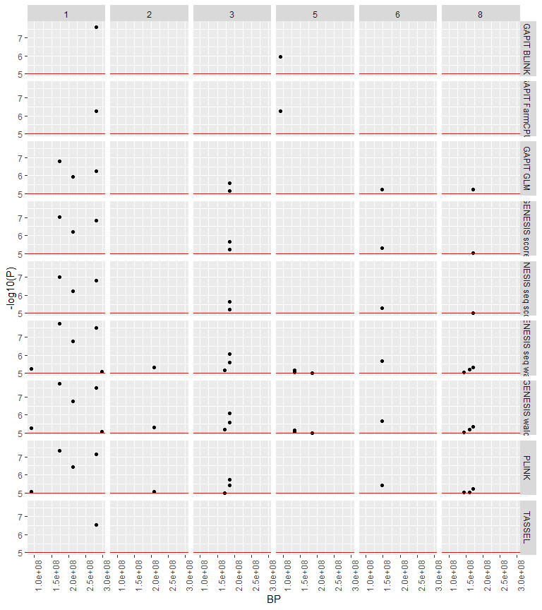

Model Comparison
================
Rutuja Gupte

# Data

``` r
gapit <- read.csv("gt5382/GAPIT.Association.Filter_GWAS_results.csv")
gmodel <- read.csv("gt5382/out.csv", skip=15)
plink <- read.table("gt5382/gt5382.qassoc", header = TRUE)
tassel <- read.table("gt5382/gt5382_output1.txt", header = TRUE)

gmodel <- drop_na(gmodel)
gmodel$CHR <- gmodel$Chrom
gmodel$BP <- as.numeric(str_extract(gmodel$Marker, "_(.*)_", group = 1))
gmodel$P <- as.numeric(gmodel$p.value)
gmodel$P <- replace_na(gmodel$P, 1e-7)
gmodel$SNP <- gmodel$Marker


gapit$CHR <- gapit$Chr
gapit$BP <- gapit$Pos
gapit$P <- gapit$P.value

plink <- drop_na(plink)
tassel <- drop_na(tassel)

gapit$method <- gapit$traits
plink$method <- "PLINK"
gmodel$method <- "GModel"

tassel$CHR <- tassel$Chr
tassel$BP <- tassel$Pos
tassel$SNP <- tassel$Marker
tassel$P <- tassel$p
tassel$method <- "TASSEL"
```

# Some plots first

``` r
manhattan(gapit)
```

<!-- -->

``` r
manhattan(plink)
```

<!-- -->

``` r
manhattan(gmodel)
```

<!-- -->

``` r
manhattan(tassel)
```

<!-- -->

# Comparisons

``` r
data.long <- bind_rows(gapit[,c("CHR", "BP", "P", "method")], 
                  plink[,c("CHR", "BP", "P", "method")],
                  gmodel[,c("CHR", "BP", "P", "method")],
                  tassel[,c("CHR", "BP", "P", "method")]
                  )

data.long <- data.long %>%
  group_by(CHR, BP, method) %>%
  summarise(P = mean(P))
```

    ## `summarise()` has grouped output by 'CHR', 'BP'. You can override using the
    ## `.groups` argument.

``` r
data.wide <- pivot_wider(distinct(data.long), names_from = method, values_from = P)
```

More plots

``` r
data.long %>% filter(P < 1e-5) %>% ggplot() +
  geom_point(aes(x=BP, y=-log10(P))) +
  geom_hline(yintercept=5, color='red') +
  facet_grid(rows=vars(CHR), cols=vars(method)) +
  theme(axis.text.x = element_text(angle = 90))
```

<!-- -->

``` r
data.long %>% filter(P < 1e-5)
```

    ## # A tibble: 41 × 4
    ## # Groups:   CHR, BP [25]
    ##      CHR       BP method            P
    ##    <int>    <dbl> <chr>         <dbl>
    ##  1     1   452827 GModel     1   e- 7
    ##  2     1  1157973 SUPER.V3   9.05e- 6
    ##  3     1 39613580 BLINK.V3   2.74e- 9
    ##  4     1 39613580 FarmCPU.V3 4.51e- 8
    ##  5     1 42721991 BLINK.V3   2.39e- 9
    ##  6     1 42721991 FarmCPU.V3 5.23e-10
    ##  7     1 42721991 SUPER.V3   4.80e- 6
    ##  8     1 70326408 BLINK.V3   6.25e- 9
    ##  9     1 78113465 GModel     6   e- 7
    ## 10     2  2072516 GModel     1   e- 7
    ## # ℹ 31 more rows

``` r
data.wide %>% filter(if_any(1:(ncol(data.wide)-2), ~ . < 1e-5)) %>% print(n=Inf, width = Inf)
```

    ## # A tibble: 25 × 9
    ## # Groups:   CHR, BP [25]
    ##      CHR       BP        PLINK      TASSEL     GModel  SUPER.V3  BLINK.V3
    ##    <int>    <dbl>        <dbl>       <dbl>      <dbl>     <dbl>     <dbl>
    ##  1     1   452827 NA           NA           0.0000001 NA        NA       
    ##  2     1  1157973  0.000568    NA          NA          9.05e- 6 NA       
    ##  3     1 39613580  0.000568    NA          NA          1.01e- 5  2.74e- 9
    ##  4     1 42721991  0.000568    NA          NA          4.80e- 6  2.39e- 9
    ##  5     1 70326408  0.000568    NA          NA          1.09e- 5  6.25e- 9
    ##  6     1 78113465  0.0405       0.0563      0.0000006 NA        NA       
    ##  7     2  2072516 NA           NA           0.0000001 NA        NA       
    ##  8     2 69565451  0.000568    NA          NA          8.34e- 6 NA       
    ##  9     2 76205547  0.0803       0.183       0.0000001 NA        NA       
    ## 10     3   229097 NA           NA           0.0000001 NA        NA       
    ## 11     3  6555509  0.000568    NA          NA          1.09e- 5 NA       
    ## 12     3 69978891  0.577        0.00000301 NA         NA        NA       
    ## 13     4   637778 NA           NA           0.0000001 NA        NA       
    ## 14     4  4488295  0.000568    NA          NA          8.34e- 6  1.12e- 6
    ## 15     4 10274863  0.000568    NA          NA          9.05e- 6 NA       
    ## 16     4 60695692  0.00953      0.0259      0.0000015 NA        NA       
    ## 17     5   222932 NA           NA           0.0000001 NA        NA       
    ## 18     5  1504132  0.000000668 NA          NA          4.98e-10  1.93e-14
    ## 19     5 11206077  0.000568    NA          NA          5.93e- 6 NA       
    ## 20     5 19864625  0.000000668 NA          NA          5.14e-10  4.72e-15
    ## 21     6   112235 NA           NA           0.0000001 NA        NA       
    ## 22     7    71273 NA           NA           0.0000001 NA        NA       
    ## 23     7 34313233  0.00260      0.00971    NA          7.28e- 7 NA       
    ## 24     7 34313291  0.00202      0.00759     0.0000001  5.21e- 7  2.25e- 7
    ## 25     8    46336 NA           NA           0.0000001 NA        NA       
    ##    FarmCPU.V3      GLM.V3
    ##         <dbl>       <dbl>
    ##  1  NA        NA         
    ##  2  NA        NA         
    ##  3   4.51e- 8 NA         
    ##  4   5.23e-10 NA         
    ##  5  NA        NA         
    ##  6  NA        NA         
    ##  7  NA        NA         
    ##  8   3.65e- 7 NA         
    ##  9  NA        NA         
    ## 10  NA        NA         
    ## 11   1.76e- 9 NA         
    ## 12  NA        NA         
    ## 13  NA        NA         
    ## 14  NA        NA         
    ## 15  NA        NA         
    ## 16  NA        NA         
    ## 17  NA        NA         
    ## 18   1.69e-15  0.00000242
    ## 19  NA        NA         
    ## 20   1.67e-14  0.00000305
    ## 21  NA        NA         
    ## 22  NA        NA         
    ## 23  NA        NA         
    ## 24   5.59e- 7 NA         
    ## 25  NA        NA

``` r
data.wide %>% filter(if_all(1:(ncol(data.wide)-2), ~ . < 1e-5)) %>% print(n=Inf, width = Inf)
```

    ## # A tibble: 0 × 9
    ## # Groups:   CHR, BP [0]
    ## # ℹ 9 variables: CHR <int>, BP <dbl>, PLINK <dbl>, TASSEL <dbl>, GModel <dbl>, SUPER.V3 <dbl>, BLINK.V3 <dbl>, FarmCPU.V3 <dbl>, GLM.V3 <dbl>
