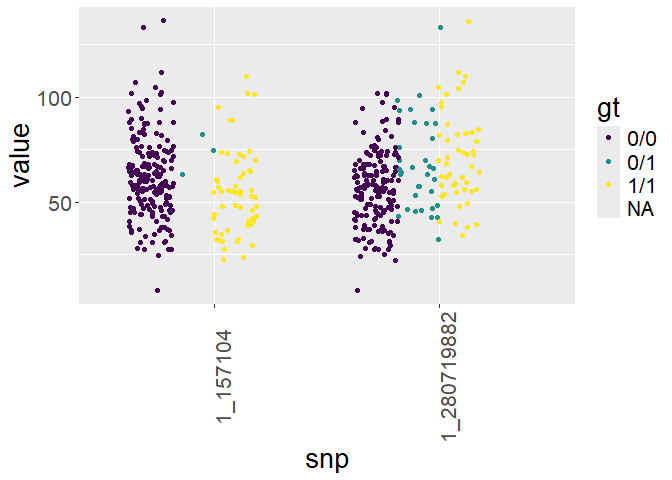
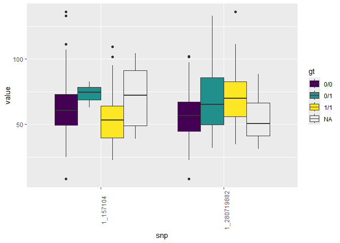
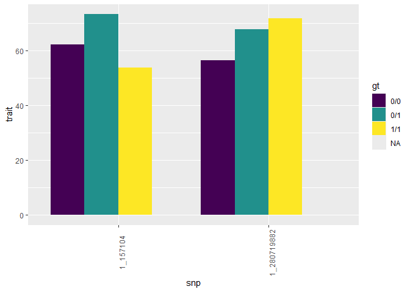

Model Comparisons
================
Rutuja Gupte

# Data

``` r
l <- grep("\\./gapit", list.dirs(), value = TRUE)
dfs <- lapply(l, function(r){
fname <- grep("GAPIT.Association.GWAS_Results", list.files(r), value=TRUE)
d <- read.csv(paste(r, fname, sep = "/"), header=TRUE)
d$traits <- fname
return(d)
})
gapit <- do.call("rbind", dfs)

# plink <- read.table("GC1.PHENO1.glm.logistic.hybrid")
plink <- read.table("sample.PHENO1.glm.linear")
colnames(plink) <- c("CHROM",   "POS",  "ID",   "REF",  "ALT",  "PROVISIONAL_REF",  "A1",   "OMITTED",  "A1_FREQ",  "TEST", "OBS_CT",   "BETA", "SE",   "T_STAT",   "P",    "ERRCODE")
# colnames(plink) <- c("CHROM", "POS",  "ID",   "REF",  "ALT",  "PROVISIONAL_REF",  "A1",   "OMITTED",  "FIRTH", "A1_FREQ", "TEST", "OBS_CT",   "OR",   "SE",   "Z_STAT",   "P",    "ERRCODE")
tassel <- read.table("sample_1.txt", header = TRUE)

gapit$CHR <- gapit$Chr
gapit$BP <- gapit$Pos
gapit$P <- gapit$P.value

plink <- drop_na(plink)
plink$CHR <- plink$CHROM
plink$BP <- plink$POS
plink$SNP <- paste(plink$CHROM, "_", plink$POS, sep="")

tassel <- drop_na(tassel)

gapit$method <- str_split_i(paste("GAPIT.", gapit$traits), "\\.V2", 1)
gapit$method <- paste0("GAPIT ", str_split_i(paste("GAPIT.", gapit$method), "Results\\.", 2))
plink$method <- "PLINK"
tassel$CHR <- tassel$Chr
tassel$BP <- tassel$Pos
tassel$SNP <- tassel$Marker
tassel$P <- tassel$p
tassel$method <- "TASSEL"

assoc1 <- read.table("genesis_snp_score.txt", header=TRUE)
assoc1$CHR <- as.numeric(assoc1$chr)
assoc1$BP <- assoc1$pos
assoc1$P <- assoc1$Score.pval
assoc1$SNP <- as.character(assoc1$variant.id)
assoc1$method <- "GENESIS score"

assoc2 <- read.table("genesis_snp_wald.txt", header=TRUE)
assoc2$CHR <- as.numeric(assoc2$chr)
assoc2$BP <- assoc2$pos
  assoc2$P <- assoc2$Joint.pval
assoc2$SNP <- as.character(assoc2$variant.id)
assoc2$method <- "GENESIS wald"

assoc3 <- read.table("genesis_seq_score.txt", header=TRUE)
assoc3$CHR <- as.numeric(assoc3$chr)
assoc3$BP <- assoc3$pos
  assoc3$P <- assoc3$Score.pval
assoc3$SNP <- as.character(assoc3$variant.id)
assoc3$method <- "GENESIS seq score"

assoc4 <- read.table("genesis_seq_wald.txt", header=TRUE)
assoc4$CHR <- as.numeric(assoc4$chr)
assoc4$BP <- assoc4$pos
  assoc4$P <- assoc4$Joint.pval
assoc4$SNP <- as.character(assoc4$variant.id)
assoc4$method <- "GENESIS seq wald"
```

# Comparisons

``` r
data.long <- bind_rows(
                  plink[,c("SNP", "CHR", "BP", "P", "method")],
                  gapit[,c("SNP", "CHR", "BP", "P", "method")],
                  tassel[,c("SNP", "CHR", "BP", "P", "method")],
                  assoc1[,c("SNP", "CHR", "BP", "P", "method")],
                  assoc2[,c("SNP", "CHR", "BP", "P", "method")],
                  assoc3[,c("SNP", "CHR", "BP", "P", "method")],
                  assoc4[,c("SNP", "CHR", "BP", "P", "method")],
                  )

data.long <- data.long %>%
  group_by(CHR, BP, method) %>%
  summarise(P = mean(P)) 
```

    ## `summarise()` has grouped output by 'CHR', 'BP'. You can override using the
    ## `.groups` argument.

``` r
data.long$SNP <- paste0(data.long$CHR, "_", data.long$BP)
data.long <- data.long %>% relocate(SNP)

data.wide <- pivot_wider(distinct(data.long), names_from = method, values_from = P)
head(data.wide)
```

    ## # A tibble: 6 × 13
    ## # Groups:   CHR, BP [6]
    ##   SNP         CHR      BP `GAPIT BLINK` `GAPIT FarmCPU` `GAPIT GLM` `GAPIT MLMM`
    ##   <chr>     <dbl>   <int>         <dbl>           <dbl>       <dbl>        <dbl>
    ## 1 1_157104      1  157104        0.123           0.608      0.00785        0.120
    ## 2 1_1947984     1 1947984        0.115           0.0859     0.424          0.122
    ## 3 1_2914066     1 2914066        0.338           0.579      0.520          0.387
    ## 4 1_2914171     1 2914171        0.707           0.994      0.986          0.963
    ## 5 1_2915078     1 2915078        0.0461          0.213      0.238          0.259
    ## 6 1_2915242     1 2915242        0.320           0.388      0.290          0.249
    ## # ℹ 6 more variables: `GENESIS score` <dbl>, `GENESIS seq score` <dbl>,
    ## #   `GENESIS seq wald` <dbl>, `GENESIS wald` <dbl>, PLINK <dbl>, TASSEL <dbl>

``` r
data.wide <- data.wide %>% relocate(SNP, CHR, BP, `GAPIT BLINK`, `GAPIT FarmCPU`, `GAPIT MLMM`, PLINK, TASSEL, `GENESIS score`, `GENESIS wald`, `GENESIS seq score`, `GENESIS seq wald`)
```

# Some plots first

``` r
# kp <- plotKaryotype(plot.type=4, chromosome=c("chr1", "chr2", "chr3", "chr4", "chr5", "chr6", "chr7"))
# kpPlotManhattan(kp, gapit %>% filter(method=="BLINK"), points.col="red")
# kpPlotManhattan(kp, gapit %>% filter(method=="FarmCPU"), points.col="red")

# CMplot(data.wide,
#        type="p",
#        plot.type="m",
#        LOG10=TRUE,
#        threshold=NULL,
#        file="jpg",
#        file.name="",
#        dpi=300,
#         file.output=FALSE,
#        verbose=TRUE,
#        width=14,
#        height=6,
#        chr.labels.angle=45, 
#        multracks=TRUE,
#        )

# SNPs <- data.wide %>% filter(if_any(1:(ncol(data.wide)-2), ~ . < 1e-5))
# CMplot(data.wide,type="p",plot.type="m",LOG10=TRUE,
#        # highlight=SNPs,highlight.type="l",
#         threshold=1e-5,threshold.col="red",threshold.lty=1,
#        # col=c("#C88862","#A4C1D9"),
#        axis.lwd = 1,
#        col=c("black","grey"),
#        cex=0.7,
#        lab.cex=0.5,
#        axis.cex=0.5,
#         signal.cex=0.5, signal.col="green",
#        # highlight.col="grey",highlight.cex=0.7,
#        width=20,
#        height=2,
#        # multraits = TRUE,
#         file="jpg",dpi=300,file.output=TRUE,verbose=TRUE,multracks=TRUE)
# 
# 
# 
# snps <- gapit%>%filter(method=="BLINK" & P < 1e-5)
# manhattan(gapit %>% filter(method=="BLINK"), highlight=snps$SNP); title("BLINK")
# 
# snps <- gapit%>%filter(method=="FarmCPU" & P < 1e-5)
# manhattan(gapit %>% filter(method=="FarmCPU"), highlight=snps$SNP); title("FarmCPU")
# 
# snps <- gapit%>%filter(method=="MLMM" & P < 1e-5)
# manhattan(gapit %>% filter(method=="MLMM"), highlight=snps$SNP); title("MLMM")
# 
# 
# 
# snps <- tassel%>%filter(P<1e-5)
# manhattan(tassel, highlight=snps$SNP); title("TASSEL")
# 
# manhattan(assoc1); title("Genesis SNP")
# manhattan(assoc2); title("Genesis Seq")
```

More plots

``` r
data.long %>% 
  filter(P < 1e-5) %>%
  ggplot() +
  geom_point(aes(x=BP, y=-log10(P))) +
  geom_hline(yintercept=5, color='red') +
  facet_grid(cols=vars(CHR), rows=vars(method)) +
  theme(axis.text.x = element_text(angle = 90))
```

<!-- -->

``` r
data.wide %>% filter(if_all(2:(ncol(data.wide)-10), ~ . < 1e-4)) %>% print(width = Inf)
```

    ## # A tibble: 2 × 13
    ## # Groups:   CHR, BP [2]
    ##   SNP           CHR        BP `GAPIT BLINK` `GAPIT FarmCPU` `GAPIT MLMM`
    ##   <chr>       <dbl>     <int>         <dbl>           <dbl>        <dbl>
    ## 1 1_280719882     1 280719882  0.0000000247     0.000000547    0.0000688
    ## 2 5_91651999      5  91651999  0.00000115       0.000000547    0.0231   
    ##          PLINK      TASSEL `GENESIS score` `GENESIS wald` `GENESIS seq score`
    ##          <dbl>       <dbl>           <dbl>          <dbl>               <dbl>
    ## 1 0.0000000728 0.000000279     0.000000145   0.0000000301         0.000000145
    ## 2 0.00262      0.0045          0.00271       0.00233              0.00271    
    ##   `GENESIS seq wald` `GAPIT GLM`
    ##                <dbl>       <dbl>
    ## 1       0.0000000301 0.000000571
    ## 2       0.00233      0.00345

Now reconciling things with the original vcf file

``` r
vcf_raw <- read.vcfR("genotype.vcf")
```

    ## Scanning file to determine attributes.
    ## File attributes:
    ##   meta lines: 10
    ##   header_line: 11
    ##   variant count: 3093
    ##   column count: 290
    ## Meta line 10 read in.
    ## All meta lines processed.
    ## gt matrix initialized.
    ## Character matrix gt created.
    ##   Character matrix gt rows: 3093
    ##   Character matrix gt cols: 290
    ##   skip: 0
    ##   nrows: 3093
    ##   row_num: 0
    ## Processed variant 1000Processed variant 2000Processed variant 3000Processed variant: 3093
    ## All variants processed

``` r
vcf_raw
```

    ## ***** Object of Class vcfR *****
    ## 281 samples
    ## 10 CHROMs
    ## 3,093 variants
    ## Object size: 7.2 Mb
    ## 3.614 percent missing data
    ## *****        *****         *****

``` r
vcf <- read.vcfR("processed.vcf.gz")
```

    ## Scanning file to determine attributes.
    ## File attributes:
    ##   meta lines: 10
    ##   header_line: 11
    ##   variant count: 2828
    ##   column count: 280
    ## Meta line 10 read in.
    ## All meta lines processed.
    ## gt matrix initialized.
    ## Character matrix gt created.
    ##   Character matrix gt rows: 2828
    ##   Character matrix gt cols: 280
    ##   skip: 0
    ##   nrows: 2828
    ##   row_num: 0
    ## Processed variant 1000Processed variant 2000Processed variant: 2828
    ## All variants processed

``` r
vcf
```

    ## ***** Object of Class vcfR *****
    ## 271 samples
    ## 10 CHROMs
    ## 2,828 variants
    ## Object size: 6.4 Mb
    ## 2.681 percent missing data
    ## *****        *****         *****

``` r
# Checking the chromosome names to spot any contigs
scaffolds <- unique(vcf@fix[,"CHROM"])
table(vcf@fix[,"CHROM"])
```

    ## 
    ##   1  10   2   3   4   5   6   7   8   9 
    ## 494 182 366 326 286 325 199 218 241 191

``` r
og_scaffolds <- unique(vcf_raw@fix[,"CHROM"])
table(vcf_raw@fix[,"CHROM"])
```

    ## 
    ##   1  10   2   3   4   5   6   7   8   9 
    ## 540 201 393 355 319 357 213 246 256 213

``` r
chrom_ref <- data.frame(og = og_scaffolds, new = as.numeric(scaffolds))
chrom_ref
```

    ##    og new
    ## 1   1   1
    ## 2   2   2
    ## 3   3   3
    ## 4   4   4
    ## 5   5   5
    ## 6   6   6
    ## 7   7   7
    ## 8   8   8
    ## 9   9   9
    ## 10 10  10

``` r
gt <- extract.gt(vcf_raw, element="GT")

rm(vcf)
rm(vcf_raw)
```

Analyzing the significant sites further

``` r
hits <- data.wide %>% filter(if_all(2:(ncol(data.wide)-2), ~ . < 1e-4))
# hits <- data.long %>% filter(P < 1e-5)
hits %>% print(width = Inf)
```

    ## # A tibble: 1 × 13
    ## # Groups:   CHR, BP [1]
    ##   SNP           CHR        BP `GAPIT BLINK` `GAPIT FarmCPU` `GAPIT MLMM`
    ##   <chr>       <dbl>     <int>         <dbl>           <dbl>        <dbl>
    ## 1 1_280719882     1 280719882  0.0000000247     0.000000547    0.0000688
    ##          PLINK      TASSEL `GENESIS score` `GENESIS wald` `GENESIS seq score`
    ##          <dbl>       <dbl>           <dbl>          <dbl>               <dbl>
    ## 1 0.0000000728 0.000000279     0.000000145   0.0000000301         0.000000145
    ##   `GENESIS seq wald` `GAPIT GLM`
    ##                <dbl>       <dbl>
    ## 1       0.0000000301 0.000000571

``` r
vcf <- read.vcfR("processed.vcf.gz")
```

    ## Scanning file to determine attributes.
    ## File attributes:
    ##   meta lines: 10
    ##   header_line: 11
    ##   variant count: 2828
    ##   column count: 280
    ## Meta line 10 read in.
    ## All meta lines processed.
    ## gt matrix initialized.
    ## Character matrix gt created.
    ##   Character matrix gt rows: 2828
    ##   Character matrix gt cols: 280
    ##   skip: 0
    ##   nrows: 2828
    ##   row_num: 0
    ## Processed variant 1000Processed variant 2000Processed variant: 2828
    ## All variants processed

``` r
hits$snp <- paste(hits$CHR, "_", hits$BP)
vcf.snps <- paste(vcf@fix[,"CHROM"], "_", vcf@fix[,"POS"])
bool_ser <- vcf.snps %in% hits$snp

# Adding a random site just to make it easier to handle the tables. And a happy side effect is that I get something to compare things with. I just got a little annoyed trying to get my single row matrix to maintain its shape.
bool_ser[1] <- TRUE

vcf@gt <- vcf@gt[bool_ser,]
vcf@fix <- vcf@fix[bool_ser,]
gt <- extract.gt(vcf, element="GT")
gt <- data.frame(gt)
gt$CHR <- as.numeric(vcf@fix[,"CHROM"])
gt$BP <- as.numeric(vcf@fix[,"POS"])
gt$REF <- (vcf@fix[,"REF"])
gt$ALT <- (vcf@fix[,"ALT"])
gt <- left_join(gt, hits, by=c("CHR", "BP"))
# duplicates <- gt %>% select(-CHR, -BP, -snp)
# bool_ser <- duplicated(duplicates)
# gt <- gt[!bool_ser, ]

# To store

# write.csv(gt %>%
#             select(CHR, BP, REF, ALT, P, method) %>%
#             left_join(chrom_ref, by=c("CHR"="new")) %>%
#             rename("CHROM" = "og") %>%
#             select(CHROM, BP, REF, ALT, P, method) %>%
#             arrange(method, P),
#           "GC1_results_cleaned.csv",
#           row.names=FALSE)

# write.csv(gt %>%
#             select(CHR, BP, REF, ALT, P, method) %>%
#             left_join(chrom_ref, by=c("CHR"="new")) %>%
#             rename("CHROM" = "og") %>%
#             select(CHROM, BP, REF, ALT, P, method) %>%
#             arrange(method, P) %>%
#             filter(method=="GAPIT. MLMM"),
#           "GAPIT. MLMM.csv",
#           row.names=FALSE)


traits <- read.table("traits.txt")
colnames(traits) <- c("sample", "value")
really_long_hits <- pivot_longer(gt, names_to="sample", values_to="gt", cols = c(-CHR, -BP, -snp,
                                                                                 -SNP,
                                                                                 -REF,
                                                                                 -ALT,
                                                                                 # -P,
                                                                                 # -method,
                                                                                 -PLINK,
                                                                                 -TASSEL,
                                                                                 -`GENESIS score`, 
                                                                                 -`GENESIS wald`, 
                                                                                 -`GENESIS seq score`, 
                                                                                 -`GENESIS seq wald`,
                                                                                 -`GAPIT BLINK`,
                                                                                 -`GAPIT FarmCPU`,
                                                                                 -`GAPIT MLMM`,
                                                                                 -`GAPIT GLM`,
                                                                                 ))
really_long_hits <- left_join(really_long_hits, traits, by="sample")
really_long_hits$snp <- paste(really_long_hits$CHR, "_", really_long_hits$BP, sep="")
summary_hits <- really_long_hits %>%
  group_by(CHR, BP, gt) %>%
  summarize(#counts = n(),
            trait = mean(value, na.rm=TRUE))
```

    ## `summarise()` has grouped output by 'CHR', 'BP'. You can override using the
    ## `.groups` argument.

``` r
summary_hits$snp <- paste(summary_hits$CHR, "_", summary_hits$BP, sep="")
allele_freq <- summary_hits %>%
  pivot_wider(names_from = "gt", values_from = "trait")

# allele_freq$maj <- (allele_freq$`0|0` + 0.5*allele_freq$`0|1` + 0.5*allele_freq$`1|0`) /
#   (allele_freq$`0|0` + allele_freq$`0|1` + allele_freq$`1|0` + allele_freq$`1|1`)
# allele_freq$min <- (allele_freq$`1|1` + 0.5*allele_freq$`0|1` + 0.5*allele_freq$`1|0`) /
#   (allele_freq$`0|0` + allele_freq$`0|1` + allele_freq$`1|0` + allele_freq$`1|1`)

allele_freq
```

    ## # A tibble: 2 × 7
    ## # Groups:   CHR, BP [2]
    ##     CHR        BP snp         `0/0` `0/1` `1/1`  `NA`
    ##   <dbl>     <dbl> <chr>       <dbl> <dbl> <dbl> <dbl>
    ## 1     1    157104 1_157104     62.3  73.3  53.9  70.9
    ## 2     1 280719882 1_280719882  56.5  67.9  71.8  54.4

Now trying to plot them all horizontally

``` r
really_long_hits %>%
  ggplot() +
  geom_point(aes(x=snp, y=value, color=gt), position=position_jitterdodge(jitter.width = 0.2, jitter.height = 0.2)) +
  theme(text = element_text(size = 20),
        axis.text.x = element_text(angle = 90)) +
  scale_color_viridis(discrete=TRUE)
```

    ## Warning: Removed 31 rows containing missing values or values outside the scale range
    ## (`geom_point()`).

<!-- -->

``` r
really_long_hits %>%
  ggplot() +
  geom_boxplot(aes(x=snp, y=value, fill=gt), position="dodge") +
  theme(axis.text.x = element_text(angle = 90)) +
  scale_fill_viridis(discrete=TRUE)
```

    ## Warning: Removed 16 rows containing non-finite outside the scale range
    ## (`stat_boxplot()`).

<!-- -->

``` r
summary_hits %>%
  ggplot() +
  geom_col(aes(x=snp, y=trait, fill=gt), position="dodge") +
  scale_fill_viridis(discrete=TRUE) +
  theme(axis.text.x = element_text(angle = 90))
```

<!-- -->

``` r
# t <- data.frame(table(really_long_hits[,c("value", "gt", "snp")])) %>%
#   pivot_wider(names_from="gt", values_from="Freq")
# t$sum = t$`0/0` + t$`0/1`+ t$`1/1`
# t
```
