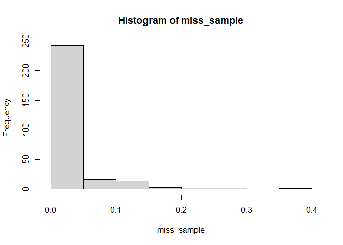
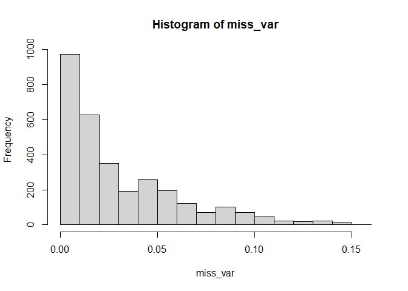

QTL Association
================
Rutuja Gupte

This is a guide to using 5 different software for genetic association
testing. The original guides of all the software are linked at the
bottom.

This is meant to be a complete guide when the only information you start
with is one genotype file and one phenotype file.

The file formatting guide here is based in R using the vcfR package. I
am assuming that R is installed. If not, please visit [The Comprehensive
R Archive Network](https://cran.rstudio.com/) and find the appropriate
version of R.

Here, I am using the R package vcfR to preprocess the files to generate
the appropriate files for all software. Some of these software require
less pre-processing than others but I am following the same routine to
clean the data to be consistent across software.

## Installations

Let us begin with the installations. There will be a lot of file
processing using vcfR. I also like to use tidyverse for managing my
data. But you do not have to use tidyverse. If these libraries are not
installed. Run the following lines of code on an R console. vcfR may
take a longer time to install.

    install.packages("tidyverse")
    install.packages("vcfR")

### Troubleshooting

The code above may work for Windows but may not work with Linux. As a
side note, some R packages need a C and a Fortran compiler to compile
some packages.

I already had the GCC compiler and had to download a Fortran compiler
when I installed this on Linux.

    sudo apt install --reinstall gcc-12
    sudo apt-get install gfortran

vcfR also requires ape and vegan packages other than the standard CRAN
repositories. For Linux, if install.packages is not working. Start by
downloading the source code for all 3 packages (.tar.gz files) in the
appropriate folder with the other packages.

The source links for the packages can be found on their official CRAN
website. 1.
[ape](%22https://cran.r-project.org/web/packages/ape/index.html%22) 2.
[vegan](%22https://cran.r-project.org/web/packages/vegan/index.html%22)
3. [vcfR](%22https://cran.r-project.org/web/packages/vcfR/index.html%22)

Then install the 3 packages from R. **Edit this code to make sure you
use the correct paths.** The first argument is the path to the tarball,
the second argument is the path to the directory with all the packages
for your R version.

    install.packages("/R/x86_64-pc-linux-gnu-library/4.4/ape_5.8.tar.gz",lib="/R/x86_64-pc-linux-gnu-library/4.4", repos = NULL, type="source")
    install.packages("/R/x86_64-pc-linux-gnu-library/4.4/vegan_2.6-6.1.tar.gz",lib="/R/x86_64-pc-linux-gnu-library/4.4", repos = NULL, type="source")
    install.packages("/R/x86_64-pc-linux-gnu-library/4.4/vcfR_1.15.0.tar.gz",lib="/R/x86_64-pc-linux-gnu-library/4.4", repos = NULL, type="source")

## Preprocessing

These steps are common for all the software. Before beginning the
specific file processing for each software please go through these
steps. I have included notes about which of the steps are strictly
necessary for which tools, so you may be able to skip some things as
needed.

I am using the sample dataset from TASSEL to demonstrate everything.

``` r
library(tidyverse)
library(vcfR)
```

Reading the data and displaying some basic information

``` r
vcf <- read.vcfR("genotype.vcf")
```

    ## Scanning file to determine attributes.
    ## File attributes:
    ##   meta lines: 10
    ##   header_line: 11
    ##   variant count: 3093
    ##   column count: 290
    ## Meta line 10 read in.
    ## All meta lines processed.
    ## gt matrix initialized.
    ## Character matrix gt created.
    ##   Character matrix gt rows: 3093
    ##   Character matrix gt cols: 290
    ##   skip: 0
    ##   nrows: 3093
    ##   row_num: 0
    ## Processed variant 1000Processed variant 2000Processed variant 3000Processed variant: 3093
    ## All variants processed

``` r
vcf
```

    ## ***** Object of Class vcfR *****
    ## 281 samples
    ## 10 CHROMs
    ## 3,093 variants
    ## Object size: 7.2 Mb
    ## 3.614 percent missing data
    ## *****        *****         *****

### Removing scaffolds

This is not necessary for this dataset but may be required for real
datasets which may have some scaffolds that are not aligned to any
chromosome. I am also changing the chromosome names to numbers. Changing
chromosome names might not be required for all software but I have found
it is better to be consistent in my inputs so that all the output files
have consistent names. Chromosome name format really does not matter for
GAPIT and for PLINK there is an extra flag that needs to be passed to
allow for non-integer chromosomes.

**Additional side note about vcfR:** A vcfR object contains meta, fix
and gt, representing the metadata, fixed columns and the variable
genotype columns respectively, which can be accessed using @. Also note
that `vcf@gt` and `extract.gt(vcf, element="GT")` are different. The
former contains multiple kinds of information about the genotypes, has
integer rownames and includes a format column. The later includes only
the genotypes and is named by the chromosome and position.

``` r
# Checking the chromosome names to spot any contigs
scaffolds <- unique(vcf@fix[,"CHROM"])
table(vcf@fix[,"CHROM"])
```

    ## 
    ##   1  10   2   3   4   5   6   7   8   9 
    ## 540 201 393 355 319 357 213 246 256 213

**This one needs to be modified based on the previous output**

``` r
# Needs to be modified based on how the dataset labels their chromosomes
chromosomes <- scaffolds[str_detect(scaffolds, "^")]
chromosomes
```

    ##  [1] "1"  "2"  "3"  "4"  "5"  "6"  "7"  "8"  "9"  "10"

Make sure the previous output has the chromosomes in the right order. If
not, modify things so that the chromosomes are in the right order.

``` r
bool_ser <- vcf@fix[, "CHROM"] %in% chromosomes

# filtering the rows of both the gt and fix part of the data
vcf@gt <- vcf@gt[bool_ser,]
vcf@fix <- vcf@fix[bool_ser,]

rm(bool_ser)
```

**This part needs additional modification if the chromosomes are not
numbered from 1**

``` r
# Here I am assuming that we have all the chromosomes starting from 1. Needs additional modification if that is not the case.
chromosomes
```

    ##  [1] "1"  "2"  "3"  "4"  "5"  "6"  "7"  "8"  "9"  "10"

``` r
for (val in 1:(length(chromosomes))){
  vcf@fix[vcf@fix[,"CHROM"] == chromosomes[val], "CHROM"] <- val
}
```

Please make sure the chromosomes look fine before proceeding

``` r
head(vcf@fix)
```

    ##      CHROM POS       ID           REF ALT QUAL FILTER INFO
    ## [1,] "1"   "157104"  "PZB00859.1" "C" "A" NA   "PASS" NA  
    ## [2,] "1"   "1947984" "PZA01271.1" "G" "C" NA   "PASS" NA  
    ## [3,] "1"   "2914066" "PZA03613.2" "T" "G" NA   "PASS" NA  
    ## [4,] "1"   "2914171" "PZA03613.1" "T" "A" NA   "PASS" NA  
    ## [5,] "1"   "2915078" "PZA03614.2" "G" "A" NA   "PASS" NA  
    ## [6,] "1"   "2915242" "PZA03614.1" "T" "A" NA   "PASS" NA

``` r
dim(vcf@gt)
```

    ## [1] 3093  282

### Removing missing values

Before I start deleting things, I want to keep a backup of the data.

``` r
vcf_temp <- vcf
```

There is no one way to do this. The sample dataset here is good enough
that we can set reasonable thresholds and still have a sizable dataset
left over. But that may not always be the case. GModel does not support
missing values. Removing all missing values at this stage would greatly
limit the SNPs going for further analysis. So, I am not removing
everything here. Everything except GModel supports missing values. So, I
am doing additional filtering before running GModel.

Starting by quantifying and plotting missingness across samples in order
to decide on the best strategy to filter the missing values. Followed by
actually removing the bad samples with an arbitrary threshold.

If you need to start over with removing samples and markers, you can
rerun from here without having to rerun the whole thing.

``` r
vcf <- vcf_temp
gt <- extract.gt(vcf, element="GT")

# First looking at missingness across samples to identify any particularly bad samples.
miss_sample <- apply(gt, 2, function(r)mean(is.na(r)))
hist(miss_sample)
```

<!-- -->

Based on the histogram, try different values of thresholds here.

``` r
# Setting an arbitrary threshold
threshold = 0.15

# Number of samples that will be removed 
length(miss_sample[miss_sample>=threshold])
```

    ## [1] 8

Actually removing the bad samples.

``` r
# Updating the vcf
vcf@gt <- vcf@gt[, c("FORMAT", colnames(gt)[apply(gt, 2, function(r)mean(is.na(r)) < threshold)])]
gt <- extract.gt(vcf, element="GT")
dim(gt)
```

    ## [1] 3093  273

Now quantifying and plotting missingness across variants. Then removing
all rows with missing values.

``` r
# Looking at missingness across variants.
miss_var <- apply(gt, 1, function(r)mean(is.na(r)))
hist(miss_var)
```

<!-- -->

Modify this based on the histogram

``` r
threshold = 0.10

# Number of rows that will be leftover after removing the missing rows.
sum(miss_var <= threshold)
```

    ## [1] 2964

Actually removing markers

``` r
# Updating the vcf
vcf@gt <- vcf@gt[apply(gt, 1, function(r)(mean(is.na(r)) <= threshold)),]
vcf@fix <- vcf@fix[apply(gt, 1, function(r)(mean(is.na(r)) <= threshold)),]
```

If you have a lot of data, skip this chunk. extract.gt takes a long time
and this part is only here to double check if things worked.

``` r
gt <- extract.gt(vcf, element="GT")

# Sanity check to see if it actually worked
head(apply(gt, 2, function(r)mean(is.na(r))))
```

    ##       33-16       38-11        4226        4722        A188       A214N 
    ## 0.024291498 0.007759784 0.022604588 0.125843455 0.018218623 0.016531714

``` r
head(apply(gt, 1, function(r)mean(is.na(r))))
```

    ##  PZB00859.1  PZA01271.1  PZA03613.2  PZA03613.1  PZA03614.2  PZA03614.1 
    ## 0.021978022 0.036630037 0.010989011 0.003663004 0.054945055 0.062271062

``` r
# Another sanity check to see if the dimensions are as expected.
dim(gt)
```

    ## [1] 2964  273

### Keeping only biallelic loci

Some software actually support multiallelic loci. But I am filtering
them out for consistency. You can skip this part. Biallelic loci are
separated by ‘,’. So, I am trying to detect ‘,’ in the ALT column and
removing rows with multiple alleles listed.

``` r
# Checking for NAs in the ALT column
alt <- vcf@fix[,"ALT"]
vcf@gt <- vcf@gt[!is.na(alt),]
vcf@fix <- vcf@fix[!is.na(alt),]
dim(vcf@gt)
```

    ## [1] 2829  274

``` r
alt <- vcf@fix[,"ALT"]
vcf@gt <- vcf@gt[!str_detect(alt,","),]
vcf@fix <- vcf@fix[!str_detect(alt,","),]

vcf
```

    ## ***** Object of Class vcfR *****
    ## 273 samples
    ## 10 CHROMs
    ## 2,828 variants
    ## Object size: 6.4 Mb
    ## 2.679 percent missing data
    ## *****        *****         *****

### Keeping only SNPs

These softwares are mainly designed to work for SNPs not indels. TASSEL
is designed to handle indels.

``` r
vcf <- extract.indels(vcf, return.indels = FALSE)
vcf
```

    ## ***** Object of Class vcfR *****
    ## 273 samples
    ## 10 CHROMs
    ## 2,828 variants
    ## Object size: 6.4 Mb
    ## 2.679 percent missing data
    ## *****        *****         *****

### Modifying the phenotype file

``` r
gt <- extract.gt(vcf, element="GT")

# Also removing samples for which we do not have phenotype information
traits <- read.table("phenotype.txt")
traits <- drop_na(traits)
colnames(gt) <- str_split_i(colnames(gt), "\\.", 1)
colnames(vcf@gt) <- str_split_i(colnames(vcf@gt), "\\.", 1)
vcf@gt <- vcf@gt[, c("FORMAT", colnames(gt)[colnames(gt) %in% traits[,1]])]
gt <- extract.gt(vcf, element="GT")
dim(gt)
```

    ## [1] 2828  271

``` r
traits <- traits[traits[,1] %in% colnames(gt),]
```

This object can be saved as a vcf file that can be used to make files
for the other models.

*Important realization:* write.vcf writes a gzipped file by default. I
had been using the wrong extension all along.

``` r
write.vcf(vcf, "processed.vcf.gz")
write.table(traits, "traits.txt", quote=FALSE, row.names=FALSE, col.names=FALSE, sep="\t")

rm(gt)
rm(vcf)
rm(vcf_temp)
rm(traits)
```

## GModel

## GAPIT

My model runner for this runs GLM, MLMM, FarmCPU and BLINK. Of these,
MLMM, FarmCPU and BLINK are designed to avoid confounding due to linkage
which means they will return fewer markers that are not linked instead
of more markers that are linked.

[Here](https://zzlab.net/GAPIT/index.html) is a link to their website.
[Here](https://zzlab.net/GAPIT/gapit_help_document.pdf) is a link to the
complete user manual.

## PLINK

This one does a lot of things but I am mainly focusing on association
using linear or logistic regression.

[Here](https://www.cog-genomics.org/plink/2.0/) is a link to their
website with instructions.

Purcell S, Neale B, Todd-Brown K, Thomas L, Ferreira M, Bender D, Maller
J, Sklar P, de Bakker P, Daly MJ, Sham PC (2007) PLINK: A Tool Set for
Whole-Genome and Population-Based Linkage Analyses. American Journal of
Human Genetics, 81.

Chang CC, Chow CC, Tellier LCAM, Vattikuti S, Purcell SM, Lee JJ (2015)
Second-generation PLINK: rising to the challenge of larger and richer
datasets. GigaScience, 4.

## TASSEL

This has a GUI too but I personally prefer the command-line.

[Here](https://www.maizegenetics.net/tassel) is a link to their website.
[Here](https://bitbucket.org/tasseladmin/tassel-5-source/wiki/UserManual)
is a link to the complete user manual.
[Here](https://bytebucket.org/tasseladmin/tassel-5-source/wiki/docs/Tassel5PipelineCLI.pdf)
are more details about the command-line version.

Bradbury PJ, Zhang Z, Kroon DE, Casstevens TM, Ramdoss Y, Buckler ES.
(2007) TASSEL: Software for association mapping of complex traits in
diverse samples. Bioinformatics 23:2633-2635.

## GENESIS

I had the hardest time with this. Needs a bunch of other packages to be
installed. But once it is set up, goes very fast and smooth.

[Here](https://www.bioconductor.org/packages/release/bioc/html/GENESIS.html)
is a link to their website.
[Here](https://www.bioconductor.org/packages/release/bioc/manuals/GENESIS/man/GENESIS.pdf)
is a link to the reference manual.
[Here](https://www.bioconductor.org/packages/release/bioc/vignettes/GENESIS/inst/doc/assoc_test_seq.html)
is more information and examples about analyzing sequencing data.
[Here](https://www.bioconductor.org/packages/release/bioc/vignettes/GENESIS/inst/doc/assoc_test.html)
is more information and examples about genetic association testing.

Gogarten SM, Sofer T, Chen H, Yu C, Brody JA, Thornton TA, Rice KM,
Conomos MP (2019). “Genetic association testing using the GENESIS
R/Bioconductor package.” Bioinformatics.
<doi:10.1093/bioinformatics/btz567>.
